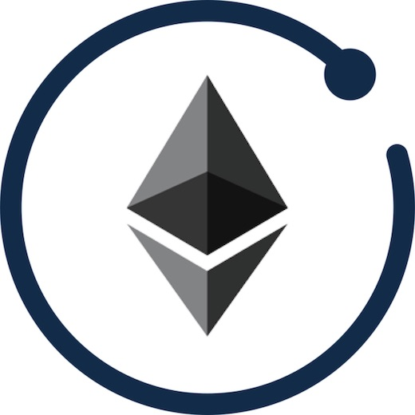

_tldr; we have created a package called [apollo-link-ethereum](https://github.com/DeltaCamp/apollo-link-ethereum) that links Apollo Client directly to Ethereum.  We've really enjoyed developing with this package and encourage any Dapp developers to try it too._

<!-- more -->



I've been building Ethereum apps now for about a year.  My toolset was the typical React + Redux + Redux Saga combination like many people use: until recently, when I decided to try something new.

I wanted a framework that:

1. Simplified my interactions with Ethereum.
2. Encouraged human readable code that was easy to debug.
3. Included a zero-configuration cache for smart contract values that didn't require a ton of boilerplate for every new project.
4. Performed well when handling dozens of AJAX requests.

After investigating [Apollo Client](https://www.apollographql.com/docs/react/), I came to realize this would be possible.

While there have been some awesome GraphQL developments (notably [Nick Johnson's GraphQL PR for Geth](https://github.com/ethereum/go-ethereum/pull/18445) and [Infura's EthQL](https://github.com/ConsenSys/ethql)), at the moment there is no cross-client way to talk to a node using [GraphQL](https://www.howtographql.com/).

So, I wrote a new "Link" for Apollo Client called [apollo-link-ethereum](https://github.com/DeltaCamp/apollo-link-ethereum).  It uses the expressiveness of the GraphQL language to interact directly with Ethereum.

For example, here is a component from the [example project](https://github.com/DeltaCamp/apollo-link-ethereum-example):

```javascript
import React, { Component } from 'react'
import { graphql } from 'react-apollo'
import { get } from 'lodash'
import gql from 'graphql-tag'

const MKR_QUERY = gql`
  query {
    MKR @contract {
      totalSupply
      someonesBalance: balanceOf(address: "0x9f8F72aA9304c8B593d555F12eF6589cC3A579A2")
    }
  }
`

graphql(MKR_QUERY)(
  class App extends Component {
    render() {
      const { data } = this.props

      return <div>
          totalSupply: { get(data, 'MKR.totalSupply', '').toString() }
          <br />
          someonesBalance: { get(data, 'MKR.someonesBalance', '').toString() }
      </div>
    }
  }
)
```

Aside from a small bit of Apollo Client setup code you don't see, this is it.  There is no other boilerplate code in the application.  This is how simple it is.

Some things I love about this approach:

1. It's entirely client-side.  There is no GraphQL server.
2. Apollo Client manages the cache.  We just need to supply sane typenames and ids for the results (which [apollo-link-ethereum](https://github.com/DeltaCamp/apollo-link-ethereum) has reasonable defaults for)
3. Multiple calls within a query only result in one re-render.  Since each GraphQL query waits until all of it's subqueries have finish, the DOM isn't thrashed by dozens of returning AJAX calls.
4. It's readable.  I'm actually enjoying throwing new components together.
5. It's easy to subscribe to events and invalidate the relevant active queries when a new event comes in.
6. The application is ready to integrate with [The Graph Protocol](https://thegraph.com/).

In the course of building our most recent dapp we have pushed this framework to the point of publishing.  It's ready for the public to play with.  We've spent most of our time on the [Ethers.js](https://docs.ethers.io/ethers.js/html/) bindings, but there are bindings for [Web3.js 1.0](https://web3js.readthedocs.io/en/1.0/) as well.  The Web3.js bindings don't support all of the features yet, but with public support we can complete the implementation.

I encourage dapp developers to give the framework a shot.  Hopefully it'll be as enlightening for you as it was for us.  We're happy for any feedback whether it's email, tweets, or best of all: Pull Requests.

Github: [apollo-link-ethereum](https://github.com/DeltaCamp/apollo-link-ethereum)

Example on Github: [apollo-link-ethereum-example](https://github.com/DeltaCamp/apollo-link-ethereum-example)
