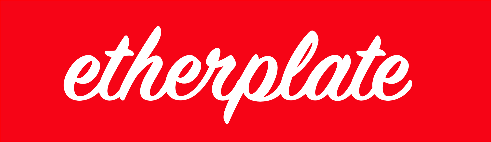
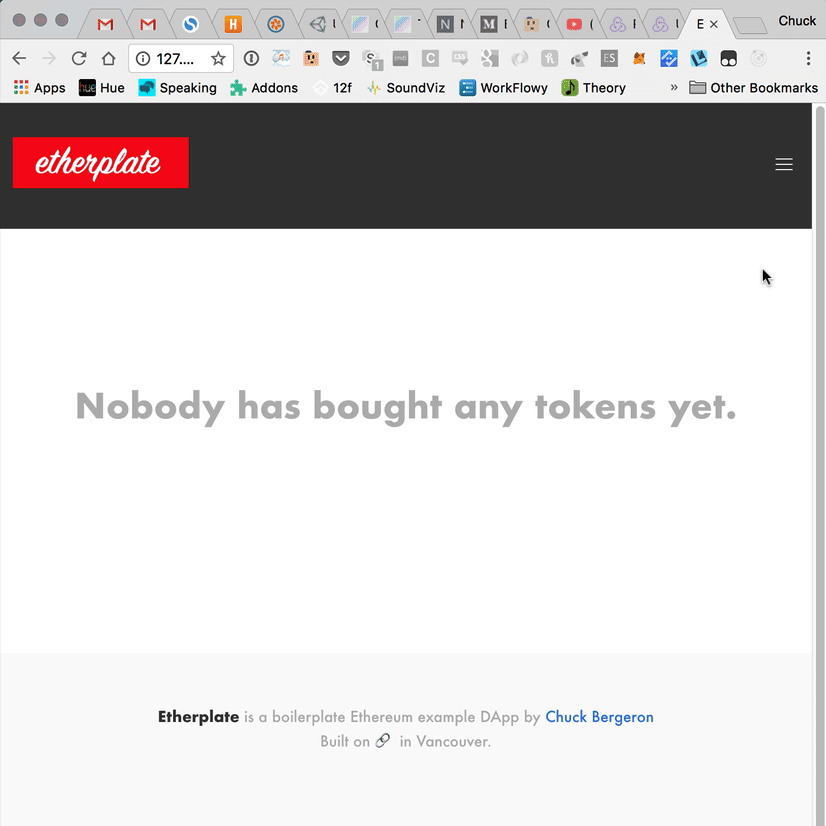

Recently I found myself wanting to dive in to blockchain development after working through the fantastic [CryptoZombies tutorials](https://cryptozombies.io/), and what better way to start working on DApps than to create something for the open source community.

<!-- more -->

Etherplate is an example project showing how you can hook up your Ethereum Non-Fungible Tokens (NFTs, ERC721, similar to CryptoKitties) contract(s) with web3. It demos minting ERC721 tokens, replaying blockchain history, subscribing to web3 events, and consuming 'view' Solidity methods in the JS frontend.

[Etherplate](http://github.com/chuckbergeron/etherplate) uses React, React Router, Redux, and Bulma (but it's always possible to rip out any of these and replace them with your favourites).

[View Source on GitHub](http://github.com/chuckbergeron/etherplate)

[View Demo on Netlify](http://etherplate.netlify.com/) _(Use either the Ropsten or Rinkeby testnets, 'Loading …' state currently waits for a mined transaction from testnet and therefore could take a few moments)_

OpenZeppelin's fantastic community-audited contracts have been integrated into Etherplate as a base to start implementing your own ERC721 standard smart contracts.

Etherplate is also a truffle box, so you can easily install it using `bash^truffle unbox chuckbergeron/etherplate` once you have the 'truffle' npm library installed on your machine.

My hope is that Etherplate gives both newcomers to the DApp world something concrete to start from, as well as giving Ethereum veterans a nice base when starting their next DApp project.
